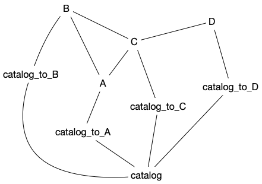

.. _cross-matching:

Catalogue cross-matching
========================

The catalogue cross-matching process refers to the action of analysing a series of parent catalogues to produce a list of unique objects along with their associations to one or more of the other parent catalogues. This definition is general regardless of the method employed to determine the cross-matches (i.e., what entries in different catalogues we consider to be the same object). At the moment, ``target_selection`` only supports the spatial cross-matching scheme described below.

Parent catalogues are loaded into the ``catalogdb`` schema as described in :ref:`here <database-server>`. This schema is meant to be accessible only from Utah and will *not* be synced to the observatories for nightly operations. The cross-matching process populates the ``catalog`` table, which contains all the unique targets for a given run of cross-matching. Each ``catalog`` target has an associated unique identifier, ``catalogid``, a 64-bit integer. catalogids do not repeat across multiple runs of cross-matching. The ``catalog`` table also includes information about the RA and Dec coordinates of the target, proper motions and parallax (if provided by the catalogue from which the target was drawn), and the ``lead`` catalogue, i.e., the name of the table for the catalogue from which the target was selected. By convention, all coordinates are given in epoch 2015.5.

In addition to populating ``catalog``, the process of cross-matching also creates/populates a series of relational, many-to-many tables ``catalog_to_<parent>`` where ``<parent>`` is the name of the related parent catalogue. Each relational table contains columns for the ``catalogid`` and ``target_id`` (the value of the primary key in the related table) that have been cross-matched, along with the distance between the two objects, and whether the match is the ``best`` (closest).

We define a cross-matching run by its ``plan`` version (the set of configuration parameters used for the run) and the ``tag`` of the ``target_selection`` code used to run that plan. For example, ``('0.1.0-beta.1', '0.2.3')`` indicates that the plan ``0.1.0-beta.1`` was run using the code tagged as ``0.2.3``. The version strings can have any value but we follow a slightly modified style of semantic versioning in which the ``X.Y.Z`` indicates major, minor, and patch modifications to the plan; while the pre-release ``alpha`` (or ``a``) indicates a test run on a small region of the sky, and ``beta`` (or ``b``) an all-sky test run. For convenience we usually refer to a given run by its ``version_id``, the primary key of the ``catalogdb.version`` row that contains the (``plan``, ``tag``) pair. ``version_id`` is a column in both ``catalog`` and the relational tables and it's used to identify the unique targets and matches from a particular run.

The ``targetdb`` schema of ``sdss5db`` contains the results of running target selection against a given cross-matching run. We talk about its structure in :ref:`its own section <target-selection>`.

The spatial cross-matching process
----------------------------------

The process of cross-matching is conceptually defined in the following diagram:

|

|

Each parent catalogue is processed in order, starting with the `TESS Input Catalog (TIC) <https://tess.mit.edu/science/tess-input-catalogue/>`__ that we adopt as our base catalogue. The TIC is fully ingested into ``catalog`` and we consider that all their targets are unique. TIC coordinates are already in 2015.5 epoch. ``catalogid`` unique identifiers are assigned sequentially.

For each additional catalogue we first identify already existing joins with the TIC or other catalogues, i.e., cross-matches from the literature that we trust. The targets that can be joined to entries already in ``catalog`` are added to the ``catalog_to_<parent>`` table. For targets that cannot be matched this way we do a spatial cross-match between the parent catalogue and ``catalog``. Targets that are within a radius of X arcsec are considered to be the same and are associated in the relational table. Finally, targets that cannot be linked or cross-matched are assumed to be new unique targets and added to ``catalog``, propagating their coordinates to epoch 2015.5 if needed.

The approach has a series of known caveats:

- The results are strongly dependent on the order in which the parent catalogues are processed.

- Only spatial separation is taken into account for cross-matching. In practice additional information could be use to discriminate between several matches (e.g., photometric cuts) and future versions of ``target_selection`` may take incorporate this option.

- The same target can potentially be associated with multiple ``catalogids``.

- We assume that all the targets in a parent table are unique within that catalogue, which is not always the case.

In practice we divide the process described above in three phases that are applied to each parent catalogue and that we now describe in more detail.

Phase 1: linking
^^^^^^^^^^^^^^^^

In the linking phase we identify all links between the parent catalogue and the ``catalog`` table. We do this by automatically creating a graph from the ``catalogdb`` schema in which tables are treated as nodes and foreign keys as edges of the graph. This graph is updated every time a relational table is created.

To find the possible join paths the library uses a modified version of the shortest path algorithm. We identify the shortest path, if it exists, between the parent table and ``catalog``. Then we remove all the edges that have been used in that path and find the next shortest path with the remaining nodes and edges. We repeat this process until all possible paths have been found. This approach ensures that we only use one join path per joining table. We also take into account the processing order and remove join paths that use relational tables of parent catalogues that have not yet been processed (and that, thus, would not have entries matching the current run).

As an example, consider the following simplified case in which we have four parent catalogs, ``A`` to ``D``. Each table is linked to ``catalog`` via a relational table ``catalog_to_X`` but note that these will only exist (or be populated) after the parent table for each one of them has been processed.

Let's start by assuming that the processing order of the catalogues is ``A`` through ``D``. In that case ``A`` won't have any join path because no other catalogue has been ingested yet. For ``B`` the only join path available is ``B — A — catalog_to_A — catalog`` (paths such as ``B — C — catalog_to_C — catalog`` are not available because ``C`` and ``D`` haver not yet been processed). For ``C`` there are two join paths going through ``A`` and ``B`` and their respective relational tables. For ``D`` the default option (shortest path) is to join through ``D — C — catalog_to_C — catalog``. Once that the node ``C`` has been traversed it is removed so it's not allowed to join via ``A`` or ``B`` in this case. It's possible to modify the path weights to select a join path via ``D — C — A — catalog_to_A — catalog``, for example (see :ref:`cross-match-config-file`).

Now imagine that the processing order is ``C, A, B, D``. In this case ``C`` does not have join paths. For ``A`` it's possible to join via ``C`` (the shortest path) or ``A — B — C — ...`` (by modifying the path weights), but not both. For ``B`` there are two join paths via ``A`` and ``C``, etc.

The user can see the join paths that will be used before starting a cross-match run by calling `.show_join_paths`.

In practice the joins are implemented as a ``CREATE TEMPORARY TABLE AS`` that creates a temporary table (which exists only until the database sessions ends) with the``catalogid`` and ``target_id`` (primary key of the table being processed) that have been linked. The rows in the temporary table are then inserted in bulk into the relational table. We use the temporary table because it allows the query planner to parallelise the join query, which is not possible with ``INSERT INTO``. This limitation may disappear in a future version of Postgresql.

Phase 2: cross-matching
^^^^^^^^^^^^^^^^^^^^^^^

Phase 2 implements the spatial cross-matching itself between the ``catalog`` table and the parent table being processed. For that we use the `Q3C <https://github.com/segasai/q3c>`__ extension, in particular the ``q3c_join`` function.  ``Q3C`` is sensitive to the order in which the cross-matching is done so we first identify the larger table being matched and make sure that's used as the second set of arguments in the ``q3c_join`` function. When the parent table being cross-matched has proper motion information we use the ``q3c_join_pm`` function instead. By default we consider two targets are matched when their spatial distance is less than one arcsec, but this parameter can be modified on a per table basis to take into account the spatial resolution of the input catalogues.

Along with performing the cross-matching, we determine and record the distance between the matches using the functions ``q3c_dist`` or ``q3c_dist_pm``. The results are aggregated using a window function and the match with the closest distance is marked as ``best=true`` in the relational table. All other matches are marked with ``best=false``.

One subtlety of the spatial cross-match is that the same object in the parent table can be matched to two or more different targets in the ``catalog`` table. This may be solved in a future version of ``target_selection``.

The planning of queries with Q3C functions is quite sensitive to the values of ``effective_cache_size`` and ``work_mem``. If the query takes significantly longer than expected it's important to confirm that the Q3C index is being used by checking the ``EXPLAIN ANALYZE`` and, if needed, increase the cache and memory values as described in :ref:`cross-match-config-file`.

Phase 3: unique targets
^^^^^^^^^^^^^^^^^^^^^^^

Phase 3 identifies targets in the parent table that have not been matched in phases 1 or 2 and inserts them into ``catalog``, copying their astrometric information and assigning them a ``catalogid``.

Given that we need to populate two tables it's more efficient to first create a temporary table with the assigned ``catalogid``, ``target_id``, and astrometric data (``ra``, ``dec``, and proper motion and parallax, if available) and then insert into ``catalog`` and the relational table from the temporary table.

If the parent table provides proper motions for its targets, the coordinates are propagated to epoch 2015.5. We also adopt the convention that all RA proper motions must be in the form :math:`{\rm pm_\alpha\,cos\delta}` and convert the ``pmra`` values if needed as they are inserted into ``catalog``.

Running a cross-match
---------------------

The planning and execution of a cross-match run is done using the `.XMatchPlanner` class. In almost every case you'll define a plan by using a :ref:`configuration file <cross-match-config-file>`, but let's start with a fairly simple example ::

    from sdssdb.peewee.sdss5db import catalogdb, database
    database.become_admin()
    tic = XMatchModel(catalogdb.TIC_v8, ra_column='ra', dec_column='dec',
                      pmra_column='pmra', pmdec_column='pmdec', epoch=2015.5)
    photoobj = XMatchModel(catalogdb.SDSS_DR13_PhotoObj, ra_column='ra', dec='dec')
    xmatch = XMatchPlanner(database, [tic, photoobj], '0.2.0')
    xmatch.run()

Here we are cross-matching only two parent tables: the TIC v8 and SDSS DR13 PhotoObj. The tables need to be defined as Peewee :class:`models <peewee:Model>`, which in this case we import from sdssdb along with the database connection. Before passing them to `.XMatchPlanner` we need to wrap them into an `.XMatchModel` which extends the model metadata with information specific to the cross-matching process. In this case we indicate the names of the RA/Dec columns and, for the TIC, the columns with the proper motion information and epoch. The ``xmatch`` information for the model is accessible via ``_meta.xmatch``; for example ::

    >>> tic._meta.xmatch
    namespace(resolution=nan,
              ra_column='ra',
              dec_column='dec',
              pmra_column='pmra',
              pmdec_column='pmdec',
              is_pmra_cos=True,
              parallax_column=None,
              epoch=2015.5,
              epoch_column=None,
              epoch_format='jyear',
              has_duplicates=False,
              has_missing_coordinates=False,
              skip=False,
              skip_phases=[],
              query_radius=None,
              row_count=1727987600,
              join_weight=1,
              database_options={})

Note that the approximate row count for the model is automatically calculated. Most parameters are self-explanatory but their definitions can be found in the API documentation for `.XMatchModel`.

The database connection needs to have write permissions to the ``catalogdb`` schema. In sdssdb we accomplish that by calling `~sdssdb.connection.DatabaseConnection.become_admin` but it can also be done by starting the Peewee connection with a user that has those privileges.

When `xmatch.run() <.XMatchPlanner.run>` is called, a temporary output table ``catalog_XXX`` is created, where ``XXX`` is an 8-char unique identifier generated from the plan string (``0.2.0`` in this example). Each model is then processed in order (for the first model to be processed only phase 3 is executed) and finally ``catalog_XXX`` is inserted into ``catalog``, and dropped.

For test runs it's useful to restrict the area on the sky to cross-match. The argument ``sample_region`` allows to define one or several circular regions with format ``(ra, dec, radius)``. For example ::

    xmatch = XMatchPlanner(database, [tic, photoobj], '0.2.0',
                           sample_region=[(100, 20, 4)])

will only cross-match and insert targets that are within four degrees of :math:`(\alpha, \delta) = (100, 20)`.

Processing order
^^^^^^^^^^^^^^^^

A key part of the cross-matching process is to define the order in which the models / parent tables will be processed. In practice this order is usually defined by passing a list of table names to `.XMatchModel` ::

    xmatch = XMatchPlanner(database, [tic, photoobj], '0.2.0',
                           order=['sdss_dr13_photoobj', 'tic_v8'])

This will ingest SDSS DR13 PhotoObj first, followed by the TIC.

`.XMatchModel` provides some tools to define the processing order automatically. If a manual order is not passed the processing order is determined by the ``order`` and ``key`` input parameters. If ``key='row_count'``, tables are sorted by number of decreasing rows so that tables with more targets are processed first (note that to speed things up the row count is always the latest known approximate determined by ``ANALYZE``); if ``key='resolution'`` the associated spatial resolution for a catalogue is used to process catalogues with high resolution first. If ``order='hierarchical'``, all the tables are divided into as many disconnected subgraphs as exist; then for each subgraph the maximum row count or minim resolution is calculated (depending on the value of ``key``). Subgraphs are sorted based on this result and then tables belonging to each subgraph are sorted by key. If ``order='global'`` the ``key`` ordering is applied to all tables without taking into account subgraphs.

It's possible to check the processing order before calling `~.XMatchPlanner.run` by accessing the attribute ``process_order`` ::

    >>> xmatch.process_order
    ['sdss_dr13_photoobj', 'tic_v8']

.. _cross-match-config-file:

The configuration file
^^^^^^^^^^^^^^^^^^^^^^

Defining cross-match models programatically as we did above is useful for initial tests but not very practical in general. Instead, cross-match runs are usually defined in a YAML configuration file, sorted by the plan version string. An equivalent configuration plan for the case we considered before would be

.. code-block:: yaml

    '0.2.0':
        order:
            - sdss_dr13_photoobj
            - tic_v8
        tables:
            tic_v8:
                ra_column: ra
                dec_column: pmdec
                epoch: 2015.5
            sdss_dr13_photoobj:
                ra_column: ra
                dec_column: dec

To read it we use the `.XMatchPlanner.read` classmethod ::

    xmatch = XMatchPlanner.read(database, '0.2.0', config_file='xmatch.yaml')

If ``config_file`` is not specified it defaults to the internal configuration file ``python/target_selection/config/xmatch.yml``. `~.XMatchPlanner.read` needs to be called with a list of all the Peewee models in the ``catalogdb`` schema. If you are using an sdssdb `~sdssdb.connection.PeeweeDatabaseConnection` you can just pass the database object and the necessary models will be retrieved automatically.

The configuration file accepts the same parameters as the arguments for `.XMatchPlanner`, with the same names, with two exceptions: you can define a list of ``exclude`` table names that will be ignored, and instead of providing a list of `.XMatchModel` models we define them in the ``tables`` section. ``tables`` must be a mapping of table names to `.XMatchModel` attributes. For each entry in ``tables`` the associated Peewee model is converted into an xmatch model by calling `.XMatchModel` with the specified parameters.

One can override configuration parameters at the time of calling `~.XMatchPlanner.read`. For example, ::

    xmatch = XMatchPlanner.read(database, '0.2.0', config_file='xmatch.yaml'
                                order=['tic_v8', 'sdss_dr13_photoobj'])

will change the processing order but otherwise load the xmatch models as before.

For convenience, it's possible to use a previous configuration plan as baseline and make modifications to it

.. code-block:: yaml

    '0.3.0':
        base_plan: '0.2.0'
        order: null
        tables:
            tic_v8:
                dec_column: new_dec
            legacy_survey_dr8:
                ra_column: ra
                dec_column: dec

This will define a new plan ``0.3.0`` with the same configuration as ``0.2.0`` but to which we have added a new parent table, ``legacy_survey_dr8``, changed the value of the declination column in ``tic_v8``, and for which we have disabled the manual processing order.

.. _cross-match-db-params:

Overriding database parameters
^^^^^^^^^^^^^^^^^^^^^^^^^^^^^^

The database server at ``operations.sdss.org`` is configured for reasonable performance in most cases, but to run cross-matching efficiently we sometimes want to override those parameters temporarily. ``database_options`` provides a framework to locally modify database configuration parameters during the phase 1-3 transactions. These changes are not permanent and revert at the end of the transaction or if an error occurs. ``database_options`` can be set when calling `.XMatchPlanner` or in the configuration file

.. code-block:: yaml

    '0.2.0':
        order:
            - sdss_dr13_photoobj
            - tic_v8
        tables:
            tic_v8:
                ra_column: ra
                dec_column: pmdec
                epoch: 2015.5
            sdss_dr13_photoobj:
                ra_column: ra
                dec_column: dec
        database_options:
            work_mem: '10GB'
            temp_buffers: '10GB'

This will set ``work_mem`` and ``temp_buffers`` to 10GB for each transaction. We can specify which phases are affected by these changes

.. code-block:: yaml

    database_options:
            work_mem: {value: '5GB', phases: [2, 3]}
            temp_buffers: '10GB'

In this case ``work_mem`` will only be modified for phases 2 and 3. It's also possible to modify the parameters for a specific table

.. code-block:: yaml

    '0.2.0':
        order:
            - sdss_dr13_photoobj
            - tic_v8
        tables:
            tic_v8:
                ra_column: ra
                dec_column: pmdec
                epoch: 2015.5
            sdss_dr13_photoobj:
                ra_column: ra
                dec_column: dec
                database_options:
                    temp_buffers: {value: '20GB', phases: [2]}
        database_options:
            work_mem: '10GB'
            temp_buffers: '10GB'

Here ``work_mem`` and ``temp_buffers`` are set to 10GB for all tables, but for phase 2 when processing ``sdss_dr13_photoobj`` the ``temp_buffers`` will be set to 20GB.

In general it makes sense to set high but safe global values for the database configuration and increase them for some very large tables. In doing so be careful to not run out of memory. This can happen easily if setting ``work_mem`` to high in phase 1. If many joins happen during linking, each one of them taking at least ``work_mem`` amount of memory, the server can easily run out of memory.

Removing a run
^^^^^^^^^^^^^^

Sometimes a run fails and we want to remove the data that it has already inserted along with any leftover temporary table. The `.remove_version` tool can help with that. To remove all entries associated with plan ``0.2.0`` in ``catalog`` and any of the ``catalog_to_X`` tables, and drop the ``catalog_XXX`` temporary table we do ::

    from sdssdb.peewee.sdss5db import database
    from target_selection.utils import remove_version
    remove_version(database, '0.2.0')
